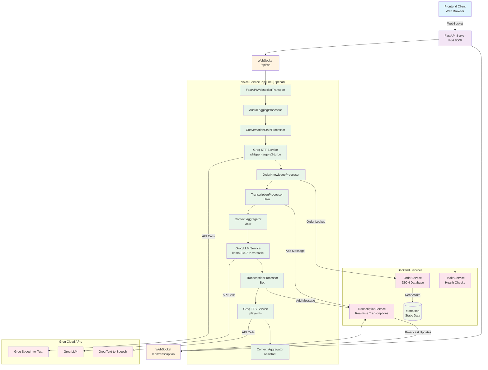

```mermaid
graph TB
    %% External Clients
    Client[Frontend Client<br/>Web Browser]

    %% API Gateway
    API[FastAPI Server<br/>Port 8000]

    %% WebSocket Endpoints
    WS_Voice[WebSocket<br/>/api/ws]
    WS_Transcript[WebSocket<br/>/api/transcription]

    %% Voice Service Pipeline
    subgraph VoicePipeline ["Voice Service Pipeline (Pipecat)"]
        Transport[FastAPIWebsocketTransport]
        AudioLogger[AudioLoggingProcessor]
        StateProcessor[ConversationStateProcessor]
        STT[Groq STT Service<br/>whisper-large-v3-turbo]
        OrderProcessor[OrderKnowledgeProcessor]
        TransProcessor[TranscriptionProcessor<br/>User]
        ContextAggregatorUser[Context Aggregator<br/>User]
        LLM[Groq LLM Service<br/>llama-3.3-70b-versatile]
        TransProcessorBot[TranscriptionProcessor<br/>Bot]
        TTS[Groq TTS Service<br/>playai-tts]
        ContextAggregatorBot[Context Aggregator<br/>Assistant]

        Transport --> AudioLogger
        AudioLogger --> StateProcessor
        StateProcessor --> STT
        STT --> OrderProcessor
        OrderProcessor --> TransProcessor
        TransProcessor --> ContextAggregatorUser
        ContextAggregatorUser --> LLM
        LLM --> TransProcessorBot
        TransProcessorBot --> TTS
        TTS --> ContextAggregatorBot
    end

    %% Services
    subgraph Services ["Backend Services"]
        OrderService[OrderService<br/>JSON Database]
        TranscriptService[TranscriptionService<br/>Real-time Transcriptions]
        HealthService[HealthService<br/>Health Checks]
        JSONDB[(store.json<br/>Static Data)]
    end

    %% External APIs
    subgraph GroqAPIs ["Groq Cloud APIs"]
        GroqSTT[Groq Speech-to-Text]
        GroqLLM[Groq LLM]
        GroqTTS[Groq Text-to-Speech]
    end

    %% Data Flow Connections
    Client -->|WebSocket| API
    API --> WS_Voice
    API --> WS_Transcript

    WS_Voice --> Transport
    WS_Transcript --> TranscriptService

    %% Pipeline Component Connections
    OrderProcessor -->|Order Lookup| OrderService
    TransProcessor -->|Add Message| TranscriptService
    TransProcessorBot -->|Add Message| TranscriptService

    %% Service Dependencies
    OrderService -->|Read/Write| JSONDB
    TranscriptService -->|Broadcast Updates| WS_Transcript

    %% API Calls
    STT -->|API Calls| GroqSTT
    LLM -->|API Calls| GroqLLM
    TTS -->|API Calls| GroqTTS

    %% Health Endpoint
    API --> HealthService

    %% Styling
    classDef client fill:#e1f5fe
    classDef api fill:#f3e5f5
    classDef ws fill:#fff3e0
    classDef pipeline fill:#e8f5e9
    classDef service fill:#fce4ec
    classDef external fill:#ffebee
    classDef data fill:#f1f8e9

    class Client client
    class API api
    class WS_Voice,WS_Transcript ws
    class Transport,AudioLogger,StateProcessor,STT,OrderProcessor,TransProcessor,ContextAggregatorUser,LLM,TransProcessorBot,TTS,ContextAggregatorBot pipeline
    class OrderService,TranscriptService,HealthService service
    class GroqSTT,GroqLLM,GroqTTS external
    class JSONDB data
```